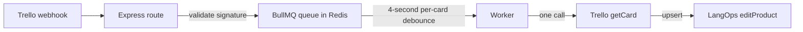

Updated todo list

Use a **4-second debounce window** to start. It is inside your 3-5 second preference, makes bursts visible during testing, and is easy to change with one constant later.

Because `editProduct` is an upsert through SQLAlchemy `merge`, the final batch policy becomes pleasantly simple:

- Final action is `deleteCard`: delete the product by card ID and do **not** call Trello.
- Any supported create or update action: call `getCard` once, then call `editProduct`.
- Multiple events for one card during four seconds: retain only the newest webhook, because fetching the card retrieves its current state.

This also means `addProduct` is no longer needed in the queued flow. You can leave it in place initially, then remove it once the new process is proven.

**What BullMQ Is**

BullMQ is a Node.js job-queue library backed by Redis.

- **Redis** is the durable shared store. It holds jobs outside your Express process, so a queued webhook survives an application restart.
- A **queue** is where the HTTP server puts accepted work.
- A **worker** is a separate process that reads jobs from the queue and performs slow work such as Trello and LangOps API calls.
- A **job** is one unit of work, here: “synchronize card `<id>` using the final webhook received in the debounce period.”
- A **debounce** combines repeated jobs with the same key. BullMQ replaces the pending job’s data and moves its scheduled time forward. That is what avoids repeated `getCard` calls.

Conceptually:



**Implementation checkpoints**

Do these as separate, reversible commits. At every checkpoint, the gateway can be rolled back by reverting just that commit.

1. **Run Redis locally**

   Add a Redis service to docker-compose.yml, with a persistent volume.

   Add `REDIS_URL` to your local environment file and deployment secrets. When Docker Compose runs both gateway and Redis, it will normally be:

   ```text
   REDIS_URL=redis://redis:6379
   ```

   Checkpoint: Redis starts and responds to a ping. No application behavior changes yet.

2. **Install the queue dependency**

   Add BullMQ to package.json. You will also use its Redis connection support.

   Checkpoint: `npm run build` continues to pass. The server still handles webhooks synchronously.

3. **Create one shared queue module**

   Add a small module, for example `src/queues/trelloWebhookQueue.ts`.

   Its responsibility is only to:
   - create the BullMQ queue named `trello-webhooks`;
   - expose a TypeScript job-data shape containing `cardId`, the full `TrelloWebhook`, and `receivedAt`;
   - export the four-second debounce constant.

   The important queue setting is a deduplication ID based on the card:

   ```text
   trello:<cardId>
   ```

   Configure BullMQ’s **debounce deduplication** behavior with:
   - TTL: `4000` milliseconds
   - extend: enabled
   - replace: enabled

   “Replace” means the newest webhook becomes the eventual worker input. “Extend” means every new event restarts the four-second quiet timer. This is better than simple deduplication, which would keep the first event and ignore later updates.

   Checkpoint: importing the module does not require Redis until a queue operation runs.

4. **Enqueue from the validated route**

   In index.ts, keep the signature validation exactly before queueing.

   Replace the direct `await adapter.processWebhook(rawWebHook)` call with:
   - extract the card ID;
   - enqueue the job through the shared queue module;
   - return `202 Accepted` once Redis accepts the job.

   Do not create `TrelloAdapter` just to process the job in the route anymore. The worker will do that later.

   This makes the public endpoint fast. Trello receives its acknowledgement while API work happens safely in the background.

   Checkpoint: send three webhooks for one card inside four seconds. You should see one delayed BullMQ job, not three.

5. **Create the worker process**

   Add `worker.ts` alongside server.ts.

   The worker:
   - connects to the `trello-webhooks` queue;
   - receives one final job per card batch;
   - creates a `TrelloAdapter`;
   - calls its processing method with the final webhook;
   - enables retries for temporary failures, for example three attempts with exponential backoff.

   Add a script such as `worker` to package.json. In production, run server.ts and `worker.ts` as separate processes or separate Docker Compose services.

   Why separate processes: an HTTP server should remain responsive even while Trello or LangOps is slow. You can also later run more worker instances without exposing more HTTP endpoints.

   Checkpoint: start the API and worker separately. Post a valid test webhook and confirm only the worker performs outbound API work.

6. **Simplify `TrelloAdapter.processWebhook`**

   In trelloAdapter.ts, choose the action before fetching a card.

   The intended behavior is:

   | Final action | Trello `getCard` | LangOps action |
   |---|---:|---|
   | `deleteCard` | No | delete by card ID |
   | `copyCard`, `createCard` | Yes, once | `editProduct` |
   | `updateCard`, check-item, custom-field, attachment | Yes, once | `editProduct` |
   | Unsupported | No | Log and finish |

   Update `LangOpsApiClient.deleteProduct` in langopsAPI.ts to accept a card ID instead of a whole `RawTrelloCard`. A Trello delete cannot safely fetch its card after deletion, and the LangOps endpoint path only needs the ID anyway.

   Checkpoint: a `deleteCard` job reaches LangOps without a Trello fetch. An update job produces exactly one fetch and one upsert.

7. **Add basic operations safeguards**

   Configure the queue with:
   - three attempts;
   - exponential retry delay;
   - completed jobs removed after a modest retention period;
   - failed jobs retained long enough for inspection.

   Log the card ID, selected final action, job ID, attempt number, and number of debounced events if you choose to track it. Avoid logging full webhook bodies in production because they become noisy quickly.

**One prerequisite to address first**

Your signature verification currently reconstructs JSON with `JSON.stringify(req.body)` in index.ts. Trello signs the original raw request bytes; reserializing parsed JSON can change whitespace or key representation. Before putting the route behind a queue, preserve the raw body during Express JSON parsing and verify that raw body. This is independent of BullMQ, but it prevents intermittent false signature failures.

**Suggested first milestone**

Implement only Redis, BullMQ, queue enqueueing, and a worker that logs a processed card ID after four seconds. Do not change adapter behavior yet. Once you can prove that three rapid webhooks for the same card produce one worker log line, move the existing adapter processing into that worker. This keeps the migration legible and makes rollback a one-commit operation.